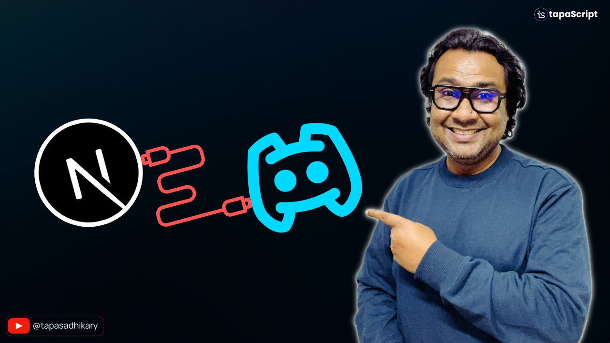

# Next.js and Discord Server Integration Using Webhook 🔌

This repository contains the code examples of building projects with Next.js and Discord Server Webhook.

## 🫶 Support
Liked it? You can show your support with a STAR(⭐).

> Many Thanks to all the `Stargazers` who have supported this project with stars(⭐)

### 🤝 Sponsor My Work
I am an independent educator and open-source enthusiast who creates meaningful projects to teach programming on my YouTube Channel. **You can support my work by [sponsoring me on GitHub](https://github.com/sponsors/atapas)**.

## 📹 Check out the video tutorial
> Quality content takes time and effort. If you appreciate that, please consider [**Subscribing to my YouTube Channel**](https://youtube.com/tapasadhikary). Thanks ❤️.

Here is the step-by-step video tutorial to build this project. You will learn the following:

- 🟢 What is Webhook?
- 🟢 How to configure webhook with Discord?
- 🟢 How to use Next.js 15 features?
- 🟢 How to use Webhook in Next.js?
- 🟢 How to use the React 19 Hook for better management of action output.

## 🏃 Run it Locally

- Clone or fork the repo
- Install dependencies using `npm install` or `yarn install`
- Create an environment variable with the key `DISCORD_WEBHOOK_URL` and value as your Discord webhook URL.
- Run it using `npm run dev` or `yarn dev`

The app will be available on `http://localhost:3000` by default. If you face any issues, follow the above video for the Discord Integration

